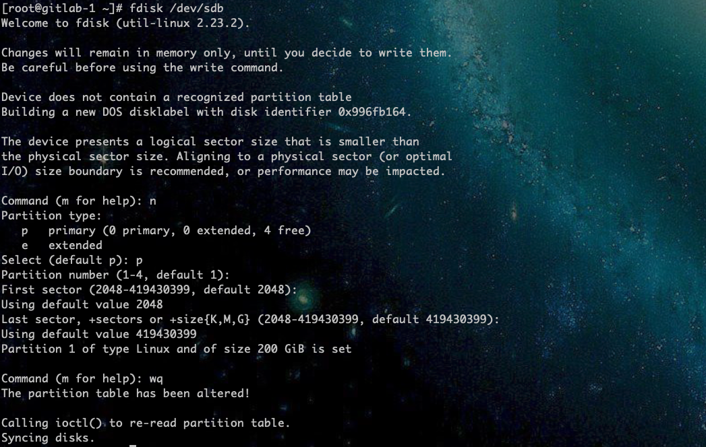
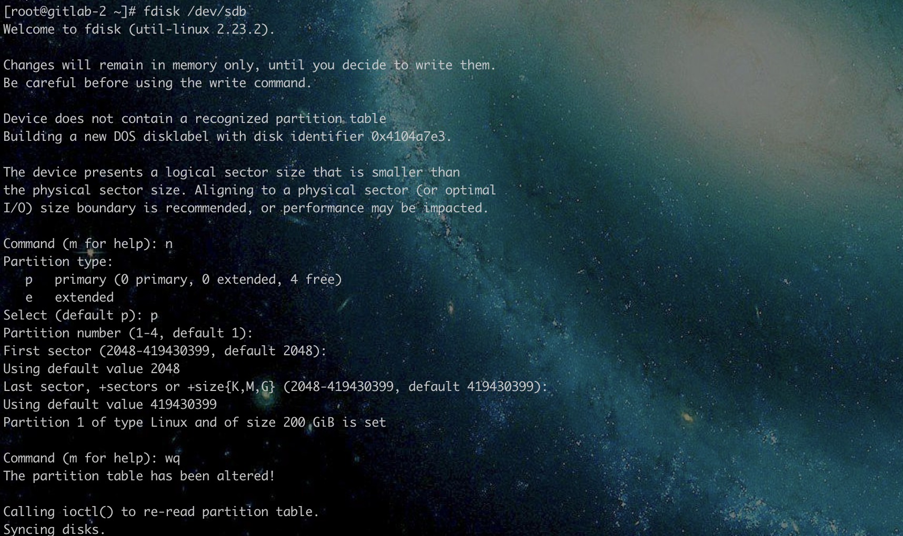
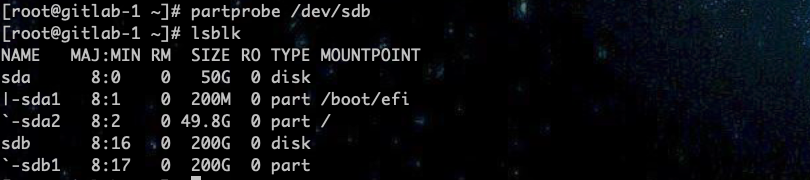
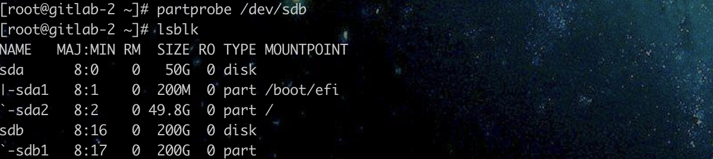
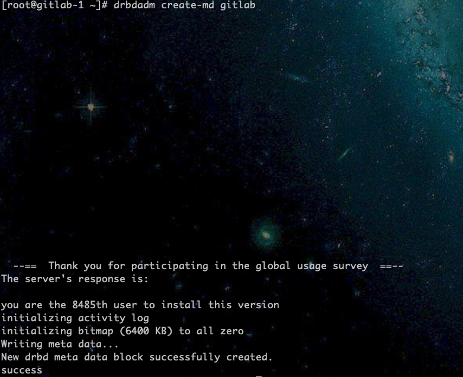
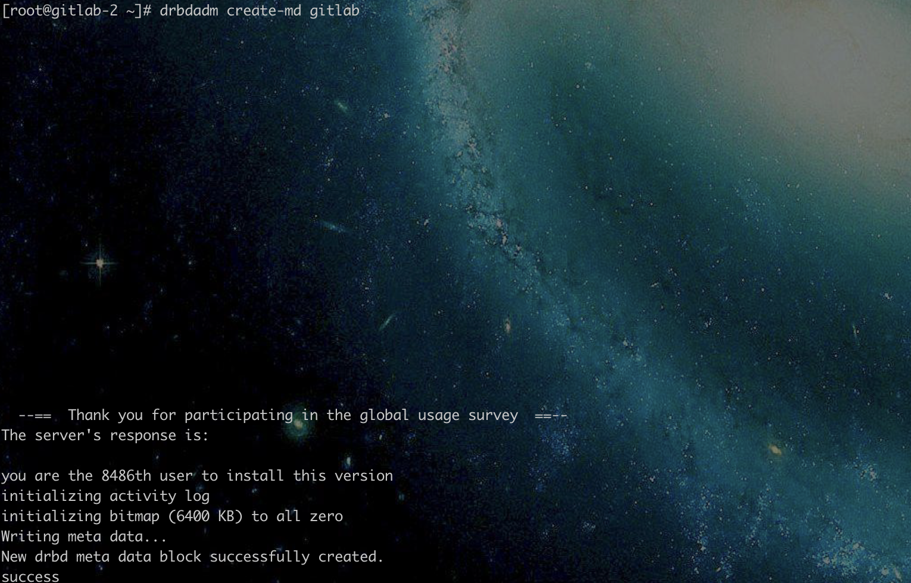

# Gitlab主备搭建

通过域名访问代码仓库（域名格式建议：codeclub.tryrus.com），gitlab使用keepalived做高可用性，使用drbd 做数据同步。


## 一、环境准备
|名称|规格|系统盘|数据盘|ip|
|---|---|---|---|---|
|gitlab-1|8C8G|50G|200G|10.13.0.31|
|gitlab-2|8C8G|50G|200G|10.13.0.32|

## 二、服务器初始化
对两台服务器做进行初始化操作

gitlab-1

```shell
# 安装wget工具
[root@gitlab-1 ~]# yum -y install wget
# 关闭防火墙
[root@gitlab-1 ~]# systemctl stop firewalld.service # 关闭防火墙
[root@gitlab-1 ~]# systemctl disable firewalld.service # 禁止开机启动
Removed symlink /etc/systemd/system/multi-user.target.wants/firewalld.service.
Removed symlink /etc/systemd/system/dbus-org.fedoraproject.FirewallD1.service.
# 关闭SELINUX
[root@gitlab-1 ~]# vim /etc/selinux/config
# 设置如下标志
SELINUX=disabled
# 重启
[root@gitlab-1 ~]# reboot
```

gitlab-2

```shell
# 安装wget工具
# 关闭防火墙
[root@gitlab-2 ~]# systemctl stop firewalld.service # 关闭防火墙
[root@gitlab-2 ~]# systemctl disable firewalld.service # 禁止开机启动
Removed symlink /etc/systemd/system/multi-user.target.wants/firewalld.service.
Removed symlink /etc/systemd/system/dbus-org.fedoraproject.FirewallD1.service.
# 关闭SELINUX
[root@gitlab-2 ~]# vim /etc/selinux/config
SELINUX=disabled
# 重启
[root@gitlab-2 ~]# reboot
```
gitlab-1 gitlab-2 要配置互为root免密登录

## 三、安装brdb

**对两台服务器都要进行配置**

### 3.1 安装elrepo源

gitlab-1 

```shell
# 创建下载目录并进入
[root@gitlab-1 ~]# mkdir downloads 
[root@gitlab-1 ~]# cd downloads/ 
# 下载elrepo
[root@gitlab-1 downloads]# wget  https://www.elrepo.org/elrepo-release-7.el7.elrepo.noarch.rpm
# 安装 elrepo
[root@gitlab-1 downloads]# rpm -ivh elrepo-release-7.el7.elrepo.noarch.rpm
```

gitlab-2 

```shell
# 创建下载目录并进入
[root@gitlab-2 ~]# mkdir downloads
[root@gitlab-1 ~]# cd downloads/
# 下载elrepo
[root@gitlab-2 downloads]# wget  https://www.elrepo.org/elrepo-release-7.el7.elrepo.noarch.rpm
# 安装 elrepo
[root@gitlab-2 downloads]# rpm -ivh elrepo-release-7.el7.elrepo.noarch.rpm
```

### 3.2 安装drbd

gitlab-1

```shell
# 安装drbd
[root@gitlab-1 ~]# yum -y install drbd900-utils kmod-drbd90
# 加载drbd模块到内核
[root@gitlab-1 ~]# modprobe drbd
[root@gitlab-1 ~]# lsmod | grep drbd
# 有如下输出则表示加载成功
drbd                  572774  0
libcrc32c              12644  2 xfs,drbd
# 设置开机启动
[root@gitlab-1 ~]# systemctl enable drbd
[root@gitlab-1 ~]# echo "modprobe drbd" >> /etc/rc.local
```

gitlab-2

```shell
# 安装drbd
[root@gitlab-2 ~]# yum -y install drbd900-utils kmod-drbd90
# 加载drbd模块到内核
[root@gitlab-2 ~]# modprobe drbd
[root@gitlab-2 ~]# lsmod | grep drbd
# 有如下输出则表示加载成功
drbd                  572774  0
libcrc32c              12644  2 xfs,drbd
# 设置开机启动
```

### 3.3 分区

给系统分区，不需要挂载

gitlab-1

```shell
# 分区
[root@gitlab-1 ~]# fdisk /dev/sdb

```



gitlab-2

```shell
[root@gitlab-2 ~]# fdisk /dev/sdb
```



### 3.4 加载分区表

gitlab-1

```shell
[root@gitlab-1 ~]# partprobe /dev/sdb
[root@gitlab-1 ~]# lsblk
```


gitlab-2 

```shell
[root@gitlab-2 ~]# partprobe /dev/sdb
[root@gitlab-2 ~]# lsblk
```


### 3.5 配置文件

gitlab-1 gitlab-2 任意节点执行

主配置文件

```shell
[root@gitlab-1 ~]# cat /etc/drbd.conf
```

有如下内容输出
```PlainText
# You can find an example in  /usr/share/doc/drbd.../drbd.conf.example

include "drbd.d/global_common.conf";
include "drbd.d/*.res";
```

通用配置文件

```shell
[root@gitlab-1 ~]# cat /etc/drbd.d/global_common.conf
```

有如下内容输出
```PlainText
# DRBD is the result of over a decade of development by LINBIT.
# In case you need professional services for DRBD or have
# feature requests visit http://www.linbit.com

global {
	usage-count yes;

	# Decide what kind of udev symlinks you want for "implicit" volumes
	# (those without explicit volume <vnr> {} block, implied vnr=0):
	# /dev/drbd/by-resource/<resource>/<vnr>   (explicit volumes)
	# /dev/drbd/by-resource/<resource>         (default for implict)
	udev-always-use-vnr; # treat implicit the same as explicit volumes

	# minor-count dialog-refresh disable-ip-verification
	# cmd-timeout-short 5; cmd-timeout-medium 121; cmd-timeout-long 600;
}

common {
	handlers {
		# These are EXAMPLE handlers only.
		# They may have severe implications,
		# like hard resetting the node under certain circumstances.
		# Be careful when choosing your poison.

		# IMPORTANT: most of the following scripts symlink to "notify.sh" which tries to send mail via "mail".
		# If you intend to use this notify.sh script make sure that "mail" is installed.
		#
		# pri-on-incon-degr "/usr/lib/drbd/notify-pri-on-incon-degr.sh; /usr/lib/drbd/notify-emergency-reboot.sh; echo b > /proc/sysrq-trigger ; reboot -f";
		# pri-lost-after-sb "/usr/lib/drbd/notify-pri-lost-after-sb.sh; /usr/lib/drbd/notify-emergency-reboot.sh; echo b > /proc/sysrq-trigger ; reboot -f";
		# local-io-error "/usr/lib/drbd/notify-io-error.sh; /usr/lib/drbd/notify-emergency-shutdown.sh; echo o > /proc/sysrq-trigger ; halt -f";
		# fence-peer "/usr/lib/drbd/crm-fence-peer.sh";
		# split-brain "/usr/lib/drbd/notify-split-brain.sh root";
		# out-of-sync "/usr/lib/drbd/notify-out-of-sync.sh root";
		# before-resync-target "/usr/lib/drbd/snapshot-resync-target-lvm.sh -p 15 -- -c 16k";
		# after-resync-target /usr/lib/drbd/unsnapshot-resync-target-lvm.sh;
		# quorum-lost "/usr/lib/drbd/notify-quorum-lost.sh root";
		# disconnected /bin/true;
	}

	startup {
		# wfc-timeout degr-wfc-timeout outdated-wfc-timeout wait-after-sb
	}

	options {
		# cpu-mask on-no-data-accessible

		# RECOMMENDED for three or more storage nodes with DRBD 9:
		# quorum majority;
		# on-no-quorum suspend-io | io-error;
	}

	disk {
		# size on-io-error fencing disk-barrier disk-flushes
		# disk-drain md-flushes resync-rate resync-after al-extents
                # c-plan-ahead c-delay-target c-fill-target c-max-rate
                # c-min-rate disk-timeout
	}

	net {
		# protocol timeout max-epoch-size max-buffers
		# connect-int ping-int sndbuf-size rcvbuf-size ko-count
		# allow-two-primaries cram-hmac-alg shared-secret after-sb-0pri
		# after-sb-1pri after-sb-2pri always-asbp rr-conflict
		# ping-timeout data-integrity-alg tcp-cork on-congestion
		# congestion-fill congestion-extents csums-alg verify-alg
		# use-rle
	}
}
```

**创建资源配置文件**

gitlab-1

```shell
cat > /etc/drbd.d/gitlab.res << EOF
resource gitlab {
    meta-disk internal;
    device /dev/drbd0; # device制定的参数最后必须有一个数字，用于global的minor-count,否则会报错。device指定drbd应用层设备。
    on gitlab-1 {
        address 10.13.0.31:7779;
        disk /dev/sdb1;    # 新建的分区磁盘
    }

    on gitlab-2 {
        address 10.13.0.32:7779;
        disk /dev/sdb1;
    }
}
EOF
```

gitlab-2

```shell
cat > /etc/drbd.d/gitlab.res << EOF
resource gitlab {
    meta-disk internal;
    device /dev/drbd0; # device制定的参数最后必须有一个数字，用于global的minor-count,否则会报错。device指定drbd应用层设备。
    on gitlab-1 {
        address 10.13.0.31:7779;
        disk /dev/sdb1;    # 新建的分区磁盘
    }

    on gitlab-2 {
        address 10.13.0.32:7779;
        disk /dev/sdb1;
    }
}
EOF
```

### 3.6 初始化DRBD元数据

gitlab-1

```shell
[root@gitlab-1 ~]# drbdadm create-md gitlab
```
执行结果如下


gitlab-2

```shell
[root@gitlab-2 ~]# drbdadm create-md gitlab
```
执行结果如下


### 3.7 启动drbd

gitlab-1

```shell
[root@gitlab-1 ~]# systemctl start drbd
```