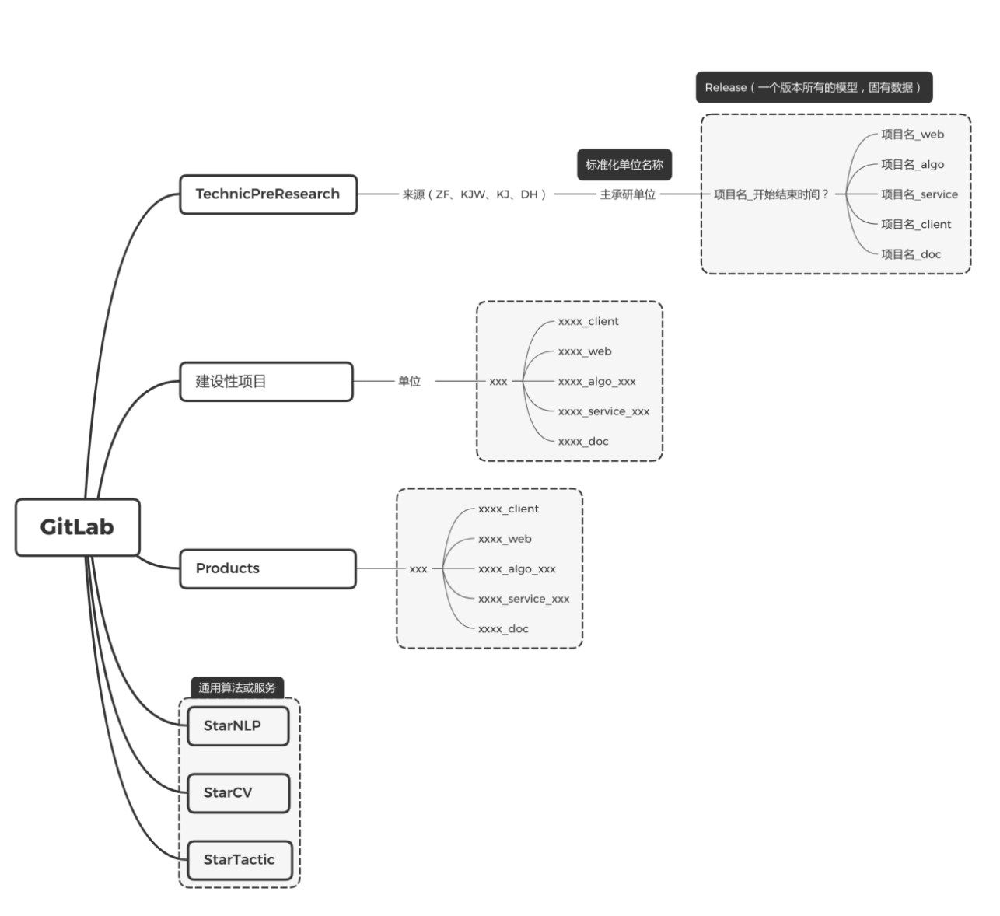

# Gitlab开发管理规范
## 1、创建Git仓库
1、创建README.md

2、创建.gitignore文件，最基本包含如下内容

```plainText
.idea
log
.DS_Store
__pycache__
```
## 2、分支管理
**环境**

|简称|备注|
|---|---|
|dev|开发和测试环境|
|prod|生产环境|

**分支划分**
master和dev不可直接提交，需要pull request, code review 后merge

|分支|名称|环境|备注|
|---|---|---|---|
|master|主分支|PROD|用于正式版本部署，结合git tag使用|
|dev|测试分支|DEV|用于测试部署，实现持续集成，便于测试|
|feature|需求开发分支|DEV|用于功能开发，由项目管理人员指定创建|
|bugfix|bug修复分支|DEV|用于修复dev分支测试出的bug|
|hotfix|紧急修复分支|PROD|用于修复master分支使用过程中发现的bug|


1. 需求收集、论证和分解后，指定开发人员从dev分支根据需求创建feature分支；
2. 开发人员在feature分支开发，本地开发测试完成后提交到分支；
3. 先将dev与feature分支合并，并修复合并的bug；
4. 在bug修复后将feature分支提交pull request到dev分支，由主开发人员审查后合并；
5. 测试人员在dev分支更新后，进行测试，并记录bug；
6. 相关人员新建bug分支，修复bug，提交pull request，由主开发人员审查后合并；
7. 测试通过后由项目/技术负责人进行code review，提交到master分支，使用git tag标记版本，并进行release发版，将相关模型和数据打包存储；
8. 线上使用过程中，发现bug，创建hotfix分支，修复后，由项目/技术负责人合并到master分支，并同步到dev分支。

## 3、GitLab的group管理

1. 分为几大基础group：预研项目，建设性项目，产品，通用算法服务
2. 基础group下面根据来源单元、承研单位等建subgroup，subgroup下面建项目的subgroup
3. 一个项目所有代码仓库都在一个subgroup里面
4. 一个项目的代码仓库共用一个主的名称，根据前后端来进行后缀命名
5. 一个项目必须有doc仓储，记录所有产品设计文档、设计图、技术设计文档、接口文档、测试文档，尽量使用Markdown格式。




## commit日志规范

建议参考规范：
<type>(scope)：<subject>
比如：<br>
fix(首页模块)：修复弹窗 JS Bug。<br>

type 表示动作类型，可分为：<br>
fix：修复 xxx Bug<br>
feat：新增 xxx 功能 <br>
test：调试 xxx 功能 <br>
style：变更 xxx 代码格式或注释 <br>
docs：变更 xxx 文档 <br>
refactor：重构 xxx 功能或方法 <br>
scope 表示影响范围，可分为：模块、类库、方法等。 <br>
subject 表示简短描述，最好不要超过 60 个字，如果有相关 Bug 的编号，建议在描述中加上。<br>

